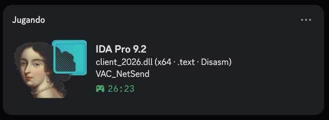
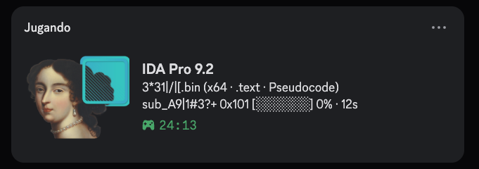
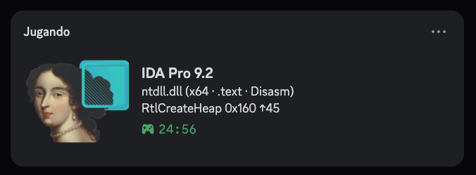
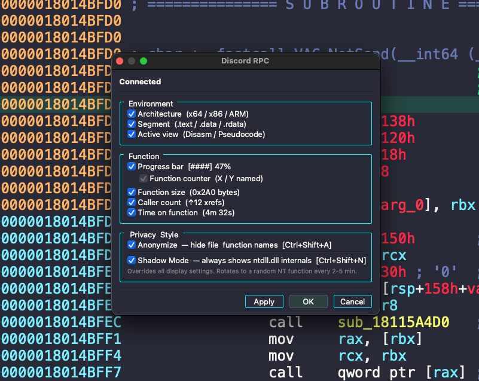

# IDA Pro Discord Rich Presence

Discord RPC plugin for IDA Pro 9.x. Shows your current analysis session on your profile, with privacy modes if you don't want people to know what you're actually looking at.

## Showcase

**Normal**



**Anonymizer** (names replaced with random strings)



**Shadow Mode** (always shows ntdll internals)



**Settings dialog**



## Features

| | |
|--|--|
| **Function tracking** | Name (demangled), size and xref count |
| **Architecture** | x86, x64, ARM, ARM64, MIPS, PPC |
| **Segment + view** | `.text` / `.data` and Disasm / Pseudocode |
| **Progress bar** | `[████░░] 67%` named vs total functions |
| **Time on function** | How long you've been on the same function |
| **Decompile flash** | Shows `Decompiling func_name...` on F5 |
| **AFK detection** | Goes idle after configurable inactivity |
| **Auto-reconnect** | Reconnects if the Discord pipe drops |
| **Settings dialog** | Toggle everything live, no restart needed |

## Privacy modes

| Mode | What Discord shows |
|------|--------------------|
| **Normal** | `client_2026.dll (x64 · .text · Disasm)` / `VAC_NetSend` |
| **Anonymizer** | `3*31\|/\|[.bin (x64 · .text · Pseudocode)` / `sub_A9\|1#3?+ 0x101 [░░░░░░] 0% · 12s` |
| **Shadow Mode** | `ntdll.dll (x64 · .text · Disasm)` / `RtlCreateHeap 0x160 ↑45` |

**Anonymizer** (`Ctrl+Shift+A`) replaces file and function names with random matrix-style strings. Arch, size, xrefs and progress are still shown.

**Shadow Mode** (`Ctrl+Shift+N`) overrides everything and pretends you're browsing ntdll. Cycles through 60+ real `Nt*`, `Rtl*` and `Ldr*` functions every 2-5 minutes.

## Installation

**1. Install pypresence**

```sh
pip install pypresence
```

On Windows with multiple Python installs, make sure it's the same one IDA uses (`import sys; print(sys.executable)` in IDA's console).

**2. Copy the plugin**

| OS | Path |
|----|------|
| Windows | `%APPDATA%\Hex-Rays\IDA Pro\plugins\` |
| macOS / Linux | `~/.idapro/plugins/` |

**3. Discord app**

The plugin comes with a working App ID, no setup needed.

To use your own app name and logo: create an application on the [Discord Developer Portal](https://discord.com/developers/applications), upload your logo as `ida_logo` under Rich Presence assets, and set your App ID in `CONFIG["app_id"]` at the top of `discord_rpc.py`.

## Hotkeys

| Windows | macOS | Action |
|---------|-------|--------|
| `Ctrl+Shift+A` | `⌃⇧A` | Toggle Anonymizer |
| `Ctrl+Shift+N` | `⌃⇧N` | Toggle Shadow Mode |
| `Edit > Plugins > Discord RPC` | `Edit > Plugins > Discord RPC` | Settings dialog |

## Configuration

All options are in `CONFIG` at the top of `discord_rpc.py`:

| Key | Default | |
|-----|---------|--|
| `app_id` | built-in | Discord Application ID |
| `anonymize` | `True` | Start with Anonymizer on |
| `shadow_mode` | `True` | Start with Shadow Mode on |
| `afk_threshold_s` | `300` | Seconds before going AFK |
| `show_*` | `True` | Toggle individual display elements |

## Troubleshooting

**Plugin doesn't load:** check that pypresence is installed for IDA's Python (`import pypresence` in the console) and that the file is in the right plugins folder.

**Disconnected:** make sure Discord is open before starting IDA. Hit Reconnect in the settings dialog, or wait, it retries every 15 seconds.

**Names not changing:** Shadow Mode overrides everything by design. Turn it off with `Ctrl+Shift+N`.

## Acknowledgements

Big thanks to the projects that came before:

- [ntpopgetdope/ida-rpc](https://github.com/ntpopgetdope/ida-rpc) (the original)
- [shikataganaii/ida-rpc-ida9](https://github.com/shikataganaii/ida-rpc-ida9) (ported to IDA 9.0)
- [JeanxPereira/ida-9.1-rpc](https://github.com/JeanxPereira/ida-9.1-rpc)
- [zfi2/IDA-9.0-Discord-RPC](https://github.com/zfi2/IDA-9.0-Discord-RPC)
- [reversedcodes/IDA-RPC](https://github.com/reversedcodes/IDA-RPC)
- [LocalPulse/ida-discord-presence](https://github.com/LocalPulse/ida-discord-presence)

The RE community is great. Keep sharing ❤️

## License

[MIT](LICENSE)
